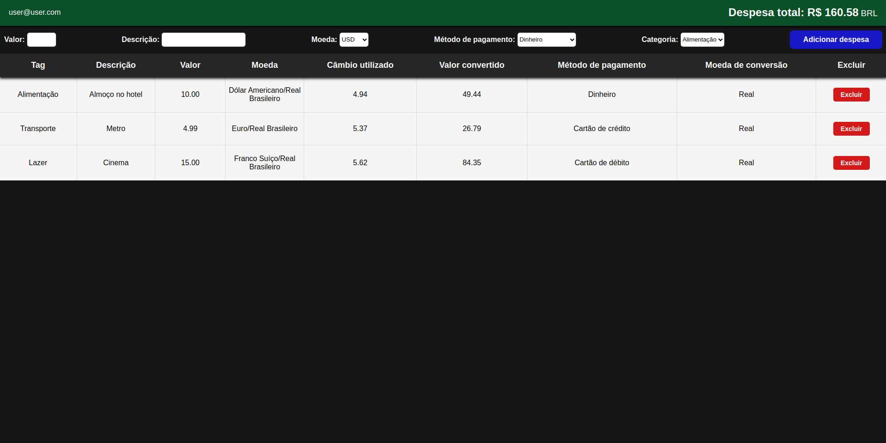

<!-- # MyWallet: uma forma simples de acompanhar suas despesas
A aplicação MyWallet tem o propósito de facilitar o controle de seus gastos, apresentando uma interface simples e intuitiva.
Nela, é possível adicionar suas compras internacionais e seus detalhes, sendo eles:
  - Valor;
  - Descrição;
  - Moeda;
  - Método de pagamento;
  - Categoria (tag);
Ao adicionar uma nova despesa, a aplicação cria um card exibindo todos os dados que você selecionou, além do **Câmbio utilizado** e **Valor convertido** para real (BRL), que são gerados automaticamente com a cotação atualizada em tempo real.
Por fim, também é exibido o valor total das despesas e a opção de excluí-las individualmente, caso necessário.

  

<strong>🛠 Detalhes técnicos</strong>
 
  Esta aplicação foi realizada a partir de um projeto do curso de Desenvolvimento Web Full Stack da Trybe, no módulo de Front-End.
  Os elementos mais notáveis do site são:
  - CSS.
  - React.
  - Redux.
  - Fetch API.

<strong>💻 Teste a aplicação!</strong>
 
  Caso queira rodar o código localmente, basta utilizar o script `npm run dev` em seu terminal.
  Isso abrirá uma página web em seu navegador, com todas as funcionalidades da aplicação já disponíveis.

-----------------------------------------------------------------------------------------------------------------------------------------------------------------------
-->
# MyWallet: an easy way to keep track of your expenses

**MyWallet** has the purpose of facilitating your spending management, introducing a simple and intuitive interface.

In the app, you can add your international purchases and their details, including:

  - Value;
  - Description;
  - Currency;
  - Payment method;
  - Category.
    
When adding a new expense, the application exhibits a card with all the information you provided, in addition to the **Exchange rate used** and **Value converted** to Brazilian Real (BRL), which are auto generated with the exchange rate updated live.

At last, it is also displayed the total value of the expenses and the option to exclude them individually.

<strong>🛠 Technical details</strong>
 
  This application was created based on a project from Trybe's Full Stack Web Development Course, in the Front-End module.
  
  The most notable features of the website are:
  
  - CSS;
  - React;
  - Redux;
  - Fetch API;
  - Vitest.
    

<strong>💻 Try it out!</strong>
 
  
If you want to run the code locally, just use the `npm run dev` script in your terminal.
This will open a web page in your browser, with all the application's features already running properly.

